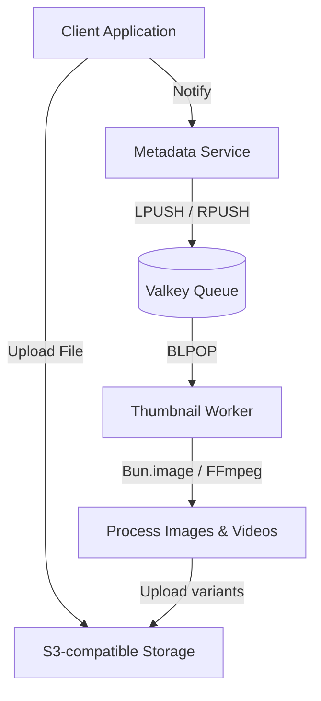

The **Thumbnail Service** is an asynchronous background worker powered by [Bun](https://bun.sh/) and FFmpeg. It listens for jobs on a Valkey queue, generates multiple thumbnail variants, and uploads them directly to our S3-compatible storage.

<Note>
  Unlike other Flux services, the Thumbnail Service does not expose an HTTP API. It is entirely queue-driven.
</Note>

## Architecture



| Component | Technology |
|---|---|
| **Runtime** | Bun |
| **Queue** | Valkey |
| **Image processing** | Built-in `Bun.image()` |
| **Video processing** | FFmpeg |
| **Storage** | S3-compatible storage |

## How it works

When a file is uploaded to the Flux Drop network, a message is dispatched to the thumbnail queue. The Thumbnail Service worker picks up the job and performs the following steps:

1. Validates the file extension to see if it's a supported image or video.
2. Generates **three WebP variants** (`mobile`, `web`, `webpre`).
3. Uploads the generated thumbnails to our storage bucket under the `thumbs/` prefix.
4. Cleans up temporary local files.

## Supported formats

### Images
`jpg`, `jpeg`, `png`, `webp`, `avif`, `tiff`, `gif`

### Videos
`mp4`, `mov`, `avi`, `m4v`, `webm`, `mkv`, `mpeg`, `mpg`

## Generated variants

For every supported file, the worker generates the following variants in **WebP** format (quality: 80):

| Variant | Width | Format |
|---|---|---|
| `mobile` | 320px | WebP |
| `web` | 480px | WebP |
| `webpre` | 1280px | WebP |

<Info>
  Aspect ratios are automatically preserved. For videos, the thumbnail is extracted from the `00:00:01` timestamp using FFmpeg.
</Info>

## Enqueueing a job

To trigger thumbnail generation, push a JSON payload to the Valkey list (default queue name: `tumb:jobs`) using `LPUSH` or `RPUSH`.

### Payload structure

```json
{
  "fileId": "<fileId>",
  "localPath": "<localPath>",
  "originalKey": "<originalKey>"
}
```

<ParamField body="fileId" type="string" required>
  Unique identifier for the file (used for tracking and logging).
</ParamField>

<ParamField body="localPath" type="string" required>
  Absolute path to the source file on the local filesystem. The worker must have read access to this path.
</ParamField>

<ParamField body="originalKey" type="string" required>
  The key of the original file. Used to generate the destination keys for the thumbnails.
</ParamField>

## Output paths

Generated thumbnails are stored in our storage using the following key structure:
`thumbs/{fileId}/{version}.webp`

For example, if the `fileId` is `3eydk1ryay6mpwu17go`, the generated thumbnails will be:
- `thumbs/3eydk1ryay6mpwu17go/mobile.webp`
- `thumbs/3eydk1ryay6mpwu17go/web.webp`
- `thumbs/3eydk1ryay6mpwu17go/webpre.webp`